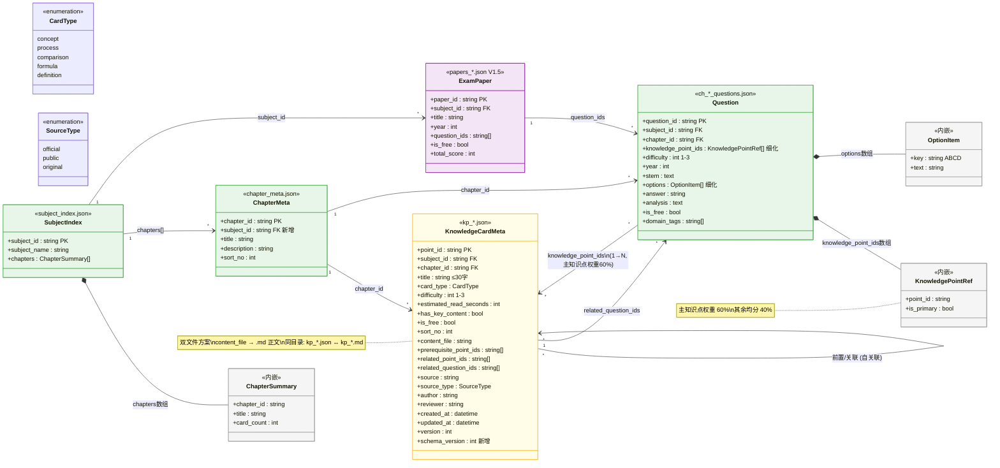
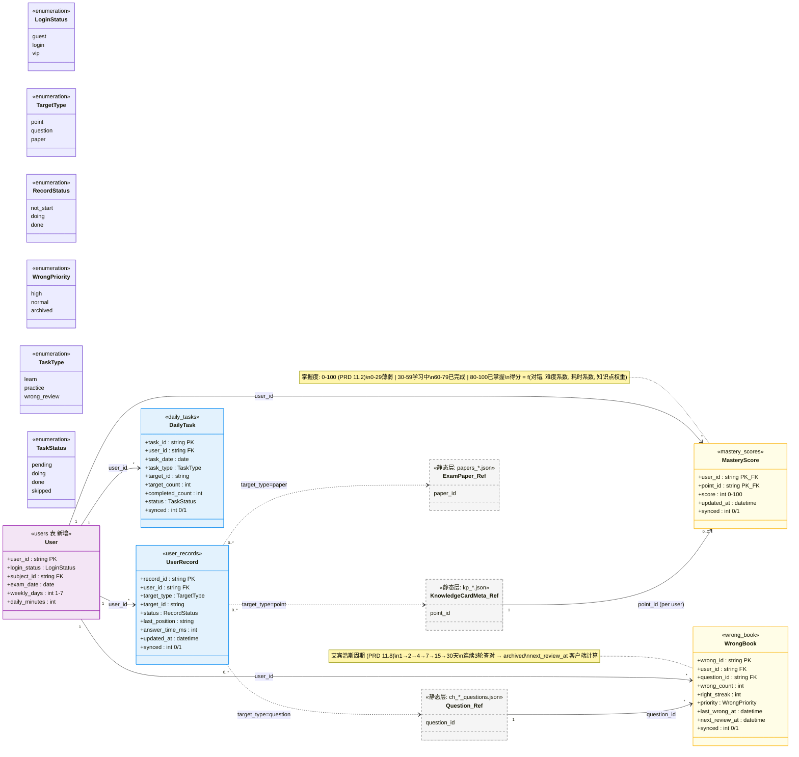

# 软考刷题 App — 知识卡片与学习数据 UML 类图

> **版本**: V1.0 | **依据**: PRD V1.7 + 数据设计文档 V1.2 + 数据字典 V1.1 | **日期**: 2026-05-09

---

## 图一：静态内容层（JSON + Markdown）



---

## 图二：动态数据层（SQLite）



---

## 跨层总览

```
┌─────────────────────────────────────────────────┐
│                 静态内容层 (CDN)                   │
│  subject_index ──→ chapter_meta ──→ kp_*.json    │
│       │                │              │           │
│       │                └──→ question  │           │
│       │                      │  ↑     │           │
│       └──→ exam_paper ──────┘  │  └───┘           │
│                                 │  关联关系         │
├─────────────────────────────────┼─────────────────┤
│                 动态数据层 (SQLite)                 │
│  users ──→ user_records ──→ target_type多态       │
│    │           (断点续学)        ↓                 │
│    ├──→ wrong_book ←── question_id                │
│    ├──→ mastery_scores ←── point_id               │
│    └──→ daily_tasks                              │
└─────────────────────────────────────────────────┘
```
